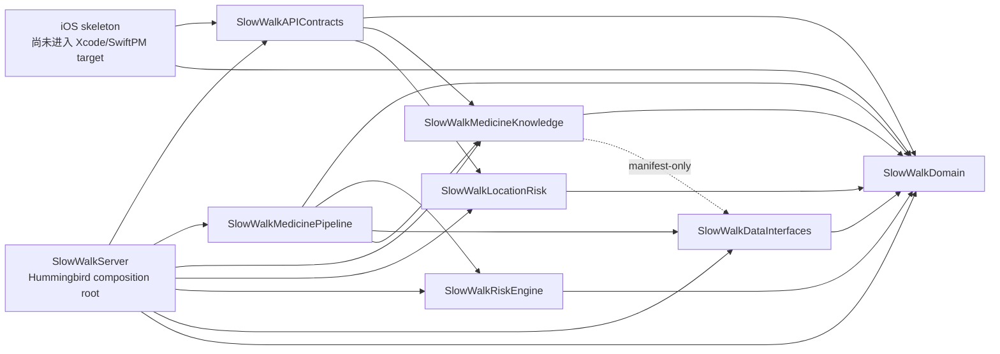

# SlowWalk 全 Swift 架构审计

> 审计日期：2026-07-25
> 审计基线：`origin/develop@bcf5750bfbf17fe0c27fd0f4db4d446f840f36b9`
> tree：`ea953251f610a98466e2996b113699ea17620885`
> 审计方式：只读静态审查、`git merge-base`、`git log`、GitHub PR/Actions 状态核验
> 平台边界：未调用、安装或修复 Windows 本机 Swift 工具链

## 审计结论

当前模块方向总体合理，未发现循环依赖，也没有证据支持全仓库重写。
`SlowWalkDomain`、`SlowWalkRiskEngine`、`SlowWalkMedicinePipeline`、
`SlowWalkMedicineKnowledge`、`SlowWalkLocationRisk` 与 Server 的主要职责已经分开；
缓存命中也不会绕过当前健康上下文和风险重算。

但当前仍不适合冻结 public API，也不适合直接开始正式 SwiftUI、Vision、
CoreLocation 或真实药品来源接入。阻塞点集中在以下四类：

1. 旧 `/api/v1/risk/assess` 信任客户端提供的完整 `Medicine` 和
   `SourceReference`，能够绕过知识源治理并得到不可信 green。
2. 知识源 warning、低 completeness 和部分来源元数据没有完整传播为保守结果。
3. Location 核心同时存在 false green 和数据质量导致 false red 的语义路径。
4. iOS skeleton 的 OCR、Network、Location 三个协议与当前正式 Pipeline/API
   用例不匹配。

本轮共登记：

- P0：0
- P1：12（其中 10 项已确认，2 项为高概率、需真实网络环境验证）
- P2：13（其中 10 项已确认，3 项为高概率演进风险）
- P3：4

“P1”不表示当前 demo 已经用于临床或已经发生数据泄露；它表示在相应能力
（iOS 风险展示、真实用户数据、真实知识源或远程 Server）接入前必须处理。

## 前置门禁与远端证据

### 已完成分支与 PR

| 能力 | PR | 合并目标 | 合并提交 | `feature head` 是否为 develop 祖先 |
| --- | --- | --- | --- | --- |
| foundation | [#4](https://github.com/XIAZIHAN001/slow-walk/pull/4) | `develop` | `c593160` | 是 |
| medicine pipeline | [#5](https://github.com/XIAZIHAN001/slow-walk/pull/5) | `develop` | `10488cb` | 是 |
| health context | [#6](https://github.com/XIAZIHAN001/slow-walk/pull/6) | `develop` | `b2dd2ef` | 是 |
| medicine knowledge source | [#8](https://github.com/XIAZIHAN001/slow-walk/pull/8) | `develop` | `69b7c71` | 是 |
| location risk core | [#10](https://github.com/XIAZIHAN001/slow-walk/pull/10) | `develop` | `bcf5750` | 是 |

核验方法：

- 对五个远端 feature branch 分别执行
  `git merge-base --is-ancestor <feature> origin/develop`，结果均为 `0`。
- `git merge-base` 对每个 feature head 返回其自身提交。
- `git log origin/develop --first-parent` 显示上述合并顺序。
- GitHub PR 状态均为 `MERGED`。

历史上 [PR #9](https://github.com/XIAZIHAN001/slow-walk/pull/9) 也曾将
`feature/location-risk-core` 合入 `main`。这是本轮开始前已经存在的远端状态；
本轮没有修改 `main`。

### 最新 develop CI

| Workflow | 结果 | 测试 | 链接 |
| --- | --- | --- | --- |
| Swift Core | success | 217/217 | [Actions run 30139367246](https://github.com/XIAZIHAN001/slow-walk/actions/runs/30139367246) |
| Swift Server | success | 60/60 | [Actions run 30139367233](https://github.com/XIAZIHAN001/slow-walk/actions/runs/30139367233) |

两条 workflow 均使用 Ubuntu 容器 `swift:6.3.2-jammy`。这只能证明 Linux
SwiftPM 构建与测试通过，不能证明 SwiftUI、Vision、CoreLocation、
Apple Foundation overlay、Data Protection 或真机生命周期已经验证。

## 1. 当前架构图

箭头表示“依赖于”；虚线表示 manifest 中声明但源码未使用的依赖。



当前主要运行数据流：

```text
Medicine:
OCR text
  → MedicineRecognitionInput
  → MedicineKnowledgeService / demo catalog
  → MedicineResolver
  → MedicationRiskContextBuilder
  → MedicationRiskEngine
  → ActionCard / API response

Location:
[LocationSample]
  → LocationDataQualityAssessor
  → Geofence + stop + moving-away evaluators
  → LocationRiskEngine
  → LocationActionCard / API response
```

不存在核心 target 反向依赖 Server/iOS，也没有 Hummingbird 或 Apple UI/定位框架
进入跨平台 Core。

## 2. 模块依赖审计

| 模块 | 实际依赖 | 结论 |
| --- | --- | --- |
| `SlowWalkDomain` | Foundation | 正确的叶子层 |
| `SlowWalkRiskEngine` | Domain | 方向正确 |
| `SlowWalkDataInterfaces` | Domain | 方向正确 |
| `SlowWalkLocationRisk` | Domain | 方向正确 |
| `SlowWalkMedicineKnowledge` | Domain；manifest 另声明 DataInterfaces | DataInterfaces 未被生产源码 import，属于冗余依赖 |
| `SlowWalkMedicinePipeline` | Domain、RiskEngine、DataInterfaces、MedicineKnowledge | 编排层方向正确 |
| `SlowWalkAPIContracts` | Domain、LocationRisk、MedicineKnowledge | wire contract 直接依赖实现模型，形成较重的客户端传递依赖 |
| `SlowWalkServer` | Hummingbird 与全部业务 target | 作为 composition root 合理，但 public surface 过宽 |

确认没有循环依赖。需要收口的是 `APIContracts` 的依赖重量和
`MedicineKnowledge → DataInterfaces` 的冗余边，不需要合并现有核心模块。

相关问题：`SW-P2-01`、`SW-P3-01`。

## 3. 公共 API 审计

Core 当前约有 202 个顶层 public 声明：

- APIContracts：20
- DataInterfaces：31
- Domain：39
- LocationRisk：32
- MedicineKnowledge：40
- MedicinePipeline：12
- RiskEngine：28

正面结论：

- 没有 `open` 声明。
- 没有需要继承扩展的 public class；主要由不可变 `struct`、`enum`、
  `protocol` 和 `actor` 组成。
- Hummingbird 类型没有进入 Core。

需要收口的部分：

- `RiskAssessmentRequestDTO`、Medicine/Location DTO 直接嵌入领域或实现模型；
  显式的 `UserHealthProfileDTO`、`MedicationRecordDTO` 反而没有进入主要
  endpoint 生产路径。
- `MockHTTPTransport`、`DemoMockHTTPTransport`、两个 mock source 和
  `MedicineKnowledgeHTTPPayload` 位于 production product 的 public surface。
- evaluator/result、Server controller/validator 和若干 typealias 仅为测试或内部
  组合而 public。

因此当前不建议冻结 public API。相关问题：`SW-P2-01`、`SW-P3-02`。

## 4. 领域模型与风险语义审计

正面结论：

- medication risk 使用 `RiskLevel` 的最高等级合并，red 不会被低等级覆盖。
- `RiskReason`、`ruleIdentifier` 和 evidence 会保留并稳定排序。
- health validation、body metrics quality 与 medication history analysis 均有
  明确结果对象。
- `apiVersion == "v1"`、profile schemaVersion 和 medicine/source dataVersion
  的主链校验已存在。

已确认的语义问题：

- `RiskLevel` 与 `LocationRiskLevel` 重复定义完全相同的四级顺序。
- `UserHealthProfile` transport 解码把三个必填数组缺失静默转换为 `[]`。
- Location 把“未命中异常阈值”当作“正在前进”的 green。
- Location 把数据质量 orange 与行为风险 orange 一起计入 red 门槛。
- MedicineKnowledge warning/completeness 没有稳定转化为风险保守状态。

版本演进注意：

- `UserHealthProfile` 缺失 schemaVersion 时使用
  `UserHealthProfile.currentSchemaVersion`。当前等于 `1`，行为正确；未来切换到
  schema 2 时不能直接修改该 fallback，否则无版本旧数据会被误解释为最新 schema。
- `SlowWalkAPI.version` 与 `/api/v1` 路由是两个独立字面量来源，当前一致，但未来
  v2 容易漂移。

相关问题：`SW-P1-02` 至 `SW-P1-05`、`SW-P2-02`、`SW-P2-09`。

## 5. Pipeline 审计

### 已验证的安全性质

- `MedicinePipeline.assess` 每次调用都会重新执行 preflight、
  `MedicationRiskContextBuilder` 和 `RiskAssessing`。
- 本地 resolution cache 命中只复用 candidate set，并用当前 confidence 再次执行
  resolver。
- 对应测试覆盖当前健康档案、当前 medication history 和 knowledge cache hit 后的
  fresh risk assessment。
- sourceDataVersion 变化会使本地 resolution cache 失效。
- 未解析、歧义、证据不足和 knowledge conservative 状态不会直接产生普通 green
  ActionCard。

### 主要风险

- 正式 medicine pipeline 以服务端知识源/目录为药品事实来源，但旧 raw risk endpoint
  绕过整个 Pipeline。
- knowledge source 的 `.warning`、低 completeness、过期 record 或不一致 reference
  尚未形成单一的 governance verdict。
- Server 默认总是注入 knowledge searcher，因此 `medicineCache` 参数对应的本地
  catalog resolution cache 分支在默认 Server 运行路径不可达，属于接口噪声而非
  当前功能故障。

相关问题：`SW-P1-01`、`SW-P1-02`、`SW-P3-04`。

## 6. 缓存与持久化审计

### 缓存

当前存在两层语义不同的缓存：

1. `MedicineResolutionCache`：缓存名称解析 candidate/result。
2. `MedicineKnowledgeCache`：缓存来源 response、validator 和聚合结果。

两层并非简单重复；前者服务 catalog-only 解析，后者服务多来源治理。但 API 将
knowledge 的 `.revalidated`、`.staleOffline` 折叠到顶层 resolution
`.expired`，客户端必须同时理解两个同名 `cacheStatus`。

已确认：

- version mismatch 会驱逐本地 resolution cache。
- cache hit 不会绕过风险重算。
- 两个内存 cache 都没有容量限制或全局过期清理。
- resolution cache 保存完整 `MedicineResolutionEvidence`，包含原始 OCR 文本。
- 304 返回的新 ETag/Last-Modified 在 service 写回时被旧 cached response 覆盖。

### 文件 Repository

正面结论：

- 单个实例内的共享状态由 actor 串行化。
- envelope schemaVersion 不匹配、空文件、损坏 JSON 和 file-not-found 均有 typed
  error。
- 正常写入采用目标目录中的临时数据与 `.atomic` replacement。

限制与风险：

- actor 只保护一个实例；两个实例指向同一文件时会发生 read-modify-write lost
  update。
- JSON 是明文，未设置 Apple Data Protection、backup exclusion 或删除/保留策略。
- 显式 staging file 在进程崩溃时可能残留完整健康数据。

相关问题：`SW-P1-07` 至 `SW-P1-09`、`SW-P2-04`、`SW-P2-06`、
`SW-H2-01`。

## 7. 并发安全审计

已确认的正面结论：

- 可变 Repository 与 cache 均为 actor。
- 生产源码没有 `@unchecked Sendable`、`try!`、`fatalError`、
  `preconditionFailure`、`as!`、`Task.detached` 或共享可变全局状态。
- 每个 API request 创建新的 JSONEncoder/JSONDecoder，没有跨请求共享可变 coder。
- HTTP 抽象层在重试前检查 cancellation，`.cancelled` 不会继续重试。

需要关注：

- 测试中有 9 处 `@unchecked Sendable`，主要是 XCTestCase 和受锁保护的测试 helper；
  这不是生产 actor 漏洞，但 Apple strict-concurrency 仍需独立编译。
- 生产源码仍有 3 个固定字面量的强制解包：两个 mock URL 和一个 GMT TimeZone。
- 同 query 的 knowledge lookup → HTTP → store 跨越多个 await，没有 single-flight 或
  generation CAS，旧的慢响应可能覆盖新的结果。
- `URLSession` 在 Apple SDK 中的 Sendable annotation、取消传播和 delegate
  isolation 尚未验证。

相关问题：`SW-H2-01`、`SW-P3-03`。

## 8. Server/API 审计

当前路由：

- `GET /health`
- `POST /api/v1/risk/assess`
- `POST /api/v1/medicine/search`
- `POST /api/v1/medicine/resolve`
- `POST /api/v1/medicine/assess`
- `POST /api/v1/location/assess`

正面结论：

- Content-Type、apiVersion、field-level decode error 和主要业务错误有结构化响应。
- 自定义 error response 不包含原始健康值、坐标、source payload 或调用栈。
- Server 默认只绑定 `127.0.0.1`，且默认知识源全部为 mock/demo。

主要问题：

- `/risk/assess` 是仍可访问的不可信旧边界。
- 同一 API v1 的 error code 同时存在 lowercase snake_case 与 UPPER_SNAKE_CASE。
- `APIErrorDTO.code` 是任意 `String`，客户端必须按 endpoint 维护 alias。
- `requestCancelled` 在 medicine controller 被映射为 503
  `KNOWLEDGE_SOURCE_UNAVAILABLE`，没有继续传播 request cancellation。
- risk/location success log 写入派生风险等级。
- 如果为了真机访问而改成非 loopback，当前 composition 没有 TLS/auth/access-control
  边界。

相关问题：`SW-P1-01`、`SW-H1-01`、`SW-P2-03`、`SW-P2-07` 至
`SW-P2-09`。

## 9. 医疗安全与隐私审计

### 已验证的安全边界

- 全仓库明确标注 demo 数据非临床用途。
- LLM 不参与风险等级。
- 缺少来源或识别证据时，正式 medicine pipeline 会阻止普通 green。
- dosage 只来自 source 字段，不由规则引擎生成。
- ActionCard 保留来源、原因与需要确认状态。
- 自定义日志未记录请求 body、坐标、过敏标签、药品名称或完整错误对象。

### 必须补齐的边界

- 不能把客户端提供的 `Medicine`/`SourceReference` 当作可信事实。
- “字段缺失”不能等价于“用户明确回答没有”。
- source warning/低 completeness/record stale 必须进入 conservative action。
- false green 的位置文案不能在没有距离趋势证据时显示。
- 数据质量错误不能自动升级为需要家属关注的 red 行为风险。
- 真实健康档案和用药史不能写入当前无保护 JSON。
- 风险等级、设备标识和 source query 应纳入数据最小化、日志保留和访问策略。

相关问题：全部 P1，以及 `SW-P2-08`。

## 10. Apple 平台接入风险

当前 `ios/` 只有 app shell 和 protocol：

- 没有 `.xcodeproj`、`.xcworkspace`、shared scheme 或 iOS build workflow。
- Core `Package.swift` 未声明 `platforms`。
- SwiftUI、Vision、CoreLocation、SwiftData、AVFoundation、权限与真机行为均未编译。
- 没有 `@MainActor` ViewModel、navigation state 或 cancellation ownership。

现有三条 adapter boundary 无法直接组成正式数据流：

```text
当前 OCR:
imageData → MedicineScanEvent
问题：MedicineScanEvent 已包含 candidate/status，位于 resolution 之后

需要:
imageData → Vision observations → MedicineRecognitionInput
         → MedicineAssessmentRequestDTO

当前 Location:
currentSnapshot(latitude, longitude, time)
问题：没有 accuracy/speed，也没有 bounded history

需要:
CoreLocation callback/AsyncSequence
  → bounded [LocationSample]（保留 accuracy/time/speed）
  → LocationAssessmentRequestDTO

当前 Network:
RiskAssessmentRequestDTO → RiskAssessmentResponseDTO
问题：指向不可信 raw risk endpoint

需要:
MedicineAssessmentRequestDTO → MedicineAssessmentResponseDTO
以及 LocationAssessmentRequestDTO → LocationAssessmentResponseDTO
```

接入难度当前为“中高”。完成 `SW-P1-01` 至 `SW-P1-06`、确定 canonical DTO/error
contract，并在 Mac 上完成一次 strict-concurrency package + simulator build 后，可降为
“中等”。

## 11. 测试覆盖缺口

当前 Linux CI 全绿，但以下关键路径未覆盖：

1. endpoint 缺少 `allergies`、`diagnosedConditions` 或
   `currentMedicineIngredientIDs` 任一字段时必须失败。
2. authoritative response/record 为 `.warning` 或低于
   `minimumCompleteness` 时不得 green。
3. response 新但 record 陈旧，以及 response/record reference/version 不一致。
4. 伪造 `Medicine.sourceReferences`、ingredient、dataVersion 不得让 raw risk endpoint
   green。
5. geofence 外短时停留、轻微横向移动、趋势不可判定时不得显示
   “已接近或到达”。
6. 两个 data-quality orange 不得被当成两个独立行为风险而升级 red。
7. 两个 Repository actor 指向同一文件时的 lost-update 测试。
8. cache capacity、批量过期清理、privacy clear、wall-clock rollback。
9. 同 query 并发 search、乱序 HTTP 返回和旧结果覆盖。
10. 304 新 ETag/Last-Modified 必须写回 cache。
11. 真实 `URLSessionHTTPTransport` 的 cancel、timeout、redirect、streaming byte cap、
    429/503 与 Retry-After。
12. 全 endpoint canonical error code snapshot。
13. 日志 capture/redaction 与 retention policy 测试。
14. Darwin SwiftPM、iOS simulator、Vision/CoreLocation adapter 与 `@MainActor`
    ViewModel 测试。
15. iOS file protection、backup exclusion、设备锁定、crash recovery 和敏感数据删除。

## 12. P0/P1/P2/P3 问题清单

### P0

未发现 P0。当前没有生产/临床部署证据，因此不会把“未来接真实数据前必须处理”
误标为正在发生的灾难性故障。

### P1：已确认

#### SW-P1-01：旧 raw risk endpoint 可绕过可信药品 Pipeline

- **分类**：已确认。
- **文件和符号**：
  - `SlowWalkAPIContracts/RiskAssessmentDTOs.swift:5-27`
  - `SlowWalkServer/ApplicationFactory.swift:70-72`
  - `SlowWalkServer/RiskAssessmentRequestValidator.swift:12-38`
  - `SlowWalkServer/RiskAssessmentService.swift:23-45`
  - `SlowWalkServerTests/SlowWalkServerTests.swift:43-84`
- **证据**：request 接收完整 `Medicine`；validator 不验证可信 source/dataVersion；
  service 直接采用客户端 medicine，并只用 `sourceReferences.isEmpty` 决定
  `EvidenceCompleteness`。现有测试用客户端构造的 source 明确断言 green、
  reasons 为空、动作是 `followVerifiedSourceInformation`。
- **可能影响**：调用方可删减 ingredient/contraindication、伪造 source，绕过
  SourcePolicy 与 health preflight，得到不可信 green。
- **最小修复**：停止默认注册或明确废弃该 endpoint；iOS 统一走
  `/api/v1/medicine/assess`。若必须保留，只接收服务端可重新解析的 identifier，
  不采用客户端 source/ingredient。
- **iOS 集成前**：必须。

#### SW-P1-02：knowledge warning、低 completeness 和 provenance 未形成保守门

- **分类**：已确认。
- **文件和符号**：
  - `SlowWalkMedicineKnowledge/SourcePolicy.swift:113-178,181-244`
  - `SlowWalkMedicineKnowledge/MedicineKnowledgeService.swift:315-358,424-533`
  - `SlowWalkMedicineKnowledge/MedicineKnowledgeModels.swift:324-330`
  - `SlowWalkMedicinePipeline/MedicinePipeline.swift:312-400`
- **证据**：
  - response/record `.warning` 未被拒绝，也未必产生 warning。
  - completeness 低于 `minimumCompleteness` 只添加 warning。
  - `requiresConfirmation` 只考虑 conflict、缺 authoritative、stale。
  - `requiresConservativeAction` 不检查 completeness 或上述 warning。
  - record `fetchedAt` 只检查未来，没有检查过旧；record/reference 与 response
    reference/version 也未绑定。
  - response 为 `.warning`、record 为 `.valid` 时 dosage 仍可能透传。
- **可能影响**：明确低质量、过旧或来源元数据矛盾的 authoritative 数据仍可进入
  non-conservative/green 路径，且 UI 可展示不一致来源。
- **最小修复**：把 policy 输出收敛为一个 governance verdict；任何 response/record
  warning、低于阈值、record stale 或 reference/version 不一致都必须设置
  `.partial`/`requiresConfirmation`，并禁止 dosage；补 Core/Server “不得 green”
  测试。
- **iOS 集成前**：风险结果与可点击来源展示前必须；真实来源前必须。

#### SW-P1-03：API 必填健康数组缺失会被静默当成空数组

- **分类**：已确认。
- **文件和符号**：
  - `SlowWalkDomain/UserHealthProfile.swift:114-142`
  - `SlowWalkDomain/HealthContextValidation.swift:220-231`
  - `SlowWalkAPIContracts/MedicinePipelineDTOs.swift:61-80`
  - `docs/API_CONTRACT.md:196-211`
- **证据**：`allergies`、`diagnosedConditions`、
  `currentMedicineIngredientIDs` 使用 `decodeIfPresent(...) ?? []`；合同将三者标为
  必填。只有四类健康证据全部为空且没有 body metrics 时才产生 incomplete warning。
- **可能影响**：例如只缺 `allergies` 但存在其他档案数据时，“未知”会变成“明确
  没有”，allergy rule 可能漏报并允许 green。
- **最小修复**：API request 使用已经存在的严格 `UserHealthProfileDTO`，仅对合同
  明确允许兼容的 `createdAt` 和 schemaVersion 提供默认；在 Server 显式映射到领域
  模型。领域持久化 decoder 可保留兼容逻辑。
- **iOS 集成前**：必须。

#### SW-P1-04：Location 将“未命中异常”误判为正在前进的 green

- **分类**：已确认。
- **文件和符号**：
  - `SlowWalkLocationRisk/LocationRiskEngine.swift:144-176`
  - `SlowWalkLocationRisk/LocationActionCardFactory.swift:43-69`
  - `SlowWalkLocationRiskTests/LocationRiskCoreTests.swift:268-303`
- **证据**：只要 geofence 外且没有 quality/risk reason，engine 直接追加 green
  `.progressingTowardDestination`，没有验证距离递减；所有 green card 标题固定为
  “已接近或到达目的地”。短时停留测试只测试 evaluator 不构成 emergency，没有
  engine/card 级断言。
- **可能影响**：可靠但短时原地停留、横向移动或未达到 moving-away 阈值的轨迹会
  收到 green 与过度肯定文案。
- **最小修复**：`.progressingTowardDestination` 必须有明确距离趋势证据；趋势
  indeterminate 时至少 yellow/neutral。ActionCard 按 arrived/progress reason
  区分文案，而不是只按 level。
- **iOS 集成前**：必须，尤其在 CoreLocation/SwiftUI 展示前。

#### SW-P1-05：Location 将数据质量 orange 计入独立行为信号并可升级 red

- **分类**：已确认。
- **文件和符号**：
  - `SlowWalkLocationRisk/LocationRiskEngine.swift:100-142,179-223,257-339`
  - `SlowWalkLocationRisk/LocationDataQuality.swift:63-120`
  - `docs/LOCATION_RISK_CORE.md:91-101`
- **证据**：`orangeSignalCount` 统计所有 rated orange reason；其中包含
  out-of-order、invalid sample、implausible jump 等数据质量 reason，而 red 文案声称
  “至少两个独立高风险信号”。配置默认两个 orange 即 red 并设置
  `requiresFamilyAttention`。
- **可能影响**：两个坏数据特征，或一个坏数据特征加一个行为规则，就可能触发
  家属关注 red；数据质量和真实风险等级被混淆。
- **最小修复**：red aggregation 只统计明确定义的独立行为信号，例如
  `prolongedStop`、`movingAway`；invalid/insufficient quality 使用独立状态或固定的
  non-green 提示，不参与 family-attention red 计数。
- **iOS 集成前**：必须。

#### SW-P1-06：iOS OCR、Network、Location 协议接在错误的用例层

- **分类**：已确认。
- **文件和符号**：
  - `ios/SlowWalkApp/Services/OCR/MedicineTextRecognizing.swift:5-10`
  - `ios/SlowWalkApp/Services/Network/RiskAssessmentRequesting.swift:3-8`
  - `ios/SlowWalkApp/Services/Location/LocationSnapshotProviding.swift:3-12`
  - `SlowWalkAPIContracts/MedicinePipelineDTOs.swift:56-123`
  - `SlowWalkAPIContracts/LocationRiskDTOs.swift:4-55`
- **证据**：
  - OCR 返回 post-resolution `MedicineScanEvent`，而正式入口需要
    `MedicineRecognitionInput`。
  - Network 只暴露不可信 raw risk DTO。
  - Location 只提供一个无 horizontal accuracy/speed 的 snapshot，而 API 需要
    `[LocationSample]`；Core 至少需要 2 个可靠点，轨迹规则需要 3 个点。
- **可能影响**：ViewModel 只能伪造字段、复制核心逻辑或绕过安全 Pipeline。
- **最小修复**：OCR 返回纯 observation/`MedicineRecognitionInput`；Network 暴露
  medicine/location 正式用例；Location adapter 提供保留 accuracy/time/speed 的
  bounded history 或 `AsyncSequence<LocationSample>`。
- **iOS 集成前**：必须。

#### SW-P1-07：文件 Repository 的 actor 不能防止同路径多实例 lost update

- **分类**：已确认。
- **文件和符号**：
  - `FileUserHealthProfileRepository.swift:35-59`
  - `FileMedicationHistoryRepository.swift:45-67`
  - `JSONRepositorySupport.swift:26-105`
  - `FileRepositoryTests.swift:197-220`
- **证据**：完整 read-modify-write 只在单个 actor 内串行；两个 actor 可同时读取同一
  旧快照后分别 atomic replace，后写者覆盖前写者。现有并发测试只使用同一 repository
  actor。
- **可能影响**：不会产生半个 JSON，但会静默丢失 profile 或 medication history，
  进而改变后续风险判断。
- **最小修复**：composition root 对每个 canonical path 保证唯一实例，并由
  path-scoped coordinator 串行化完整事务；如需多进程，再增加 file lock 或版本化
  compare-and-swap。
- **iOS 集成前**：若采用文件 Repository，必须。

#### SW-P1-08：文件 Repository 明文保存健康资料且 crash 可残留 staging

- **分类**：已确认限制。
- **文件和符号**：
  - `JSONRepositorySupport.swift:72-103`
  - `FileUserHealthProfileRepository`
  - `FileMedicationHistoryRepository`
  - `ios/README.md:50-55`
- **证据**：完整档案/历史以 pretty-printed JSON 写入临时文件和目标文件；没有
  encryption、Apple Data Protection、backup exclusion、retention/deletion policy。
  staging 仅靠 `defer` 清理，进程终止时可能残留。
- **可能影响**：真实健康资料可能进入未保护文件、备份或多个临时副本。
- **最小修复**：当前实现继续限定为 demo/server；iOS 使用受保护 Application
  Support adapter，设置合适的 file protection 与 backup policy，并验证删除。
  如需 payload encryption，密钥放 Keychain。
- **iOS 集成前**：fixture UI 不阻塞；写入真实用户数据前必须。

#### SW-P1-09：内存缓存无容量上限并长期保留 OCR/query 数据

- **分类**：已确认。
- **文件和符号**：
  - `SlowWalkDataInterfaces/InMemoryMedicineCache.swift:5-82`
  - `SlowWalkMedicineKnowledge/MedicineKnowledgeCache.swift:61-123`
  - `SlowWalkDomain/MedicineRecognition.swift:90-124`
  - `SlowWalkMedicinePipeline/MedicinePipeline.swift:273-300`
- **证据**：两个 dictionary cache 无 capacity/LRU；过期项只在相同 key 再次 lookup
  时处理，超过 offline grace 的 knowledge entry 仍留在 dictionary。resolution cache
  保存包含 `recognizedTexts`、normalized text、discarded noise 的完整 evidence。
- **可能影响**：大量唯一 query 可造成内存持续增长；OCR/药品查询等敏感输入在无
  业务需要时长期驻留。
- **最小修复**：缓存最小 candidate ID/version，不缓存原始 OCR evidence；加入容量、
  LRU/定期 purge、per-user privacy clear 和压力测试。
- **iOS 集成前**：真实 OCR 前必须；公开 Server 前必须。

#### SW-P1-10：HTTP body 上限在完整缓冲后才生效

- **分类**：已确认。
- **文件和符号**：
  - `SlowWalkMedicineKnowledge/HTTPTransport.swift:89-122`
  - `SlowWalkMedicineKnowledge/HTTPMedicineKnowledgeSource.swift:291-298`
  - `HTTPMedicineKnowledgeSourceTests.swift:147-161`
- **证据**：`URLSession.data(for:)` 先把完整 response 读入 `Data`，随后才检查
  `maximumResponseBytes`；测试使用已经构造完成的 mock Data。
- **可能影响**：错误或被攻陷的来源能在限制前消耗大量内存，导致 Server/iOS
  进程终止；当前“最大响应体”不是传输层资源上限。
- **最小修复**：把 byte limit 下沉到 streaming/delegate transport，累计字节并在
  超限时取消；`Content-Length` 只能作为提前拒绝优化。
- **iOS 集成前**：mock iOS 不阻塞；真实 HTTP source 前必须。

### P1：高概率风险

#### SW-H1-01：非 loopback Server 缺少 TLS 与访问控制边界

- **分类**：高概率风险；当前默认 loopback/demo，尚不是已发生泄露。
- **文件和符号**：
  - `SlowWalkServer/SlowWalkServerConfiguration.swift:1-14`
  - `SlowWalkServer/ApplicationFactory.swift:55-57,132-137`
  - `server/Package.swift:18-23`
- **证据**：configuration 只有 host/port/serverName；application 配置普通 hostname
  address；只有 request logging middleware，没有 auth/TLS/access-control 组合。Location
  request 会携带完整坐标历史。
- **可能影响**：为真机把 host 改成非 loopback 后，健康档案和轨迹可能经无认证普通
  HTTP 暴露；iOS ATS 也可能拒绝。
- **最小修复**：位置计算优先留在设备本地；远程 medicine API 上线前通过受审查的
  TLS termination、authentication、authorization、rate limit 和 retention policy。
  在此之前明确拒绝非 loopback production 启动。
- **iOS 集成前**：若连接真实远程 Server，必须。

#### SW-H1-02：知识源 redirect 未绑定到白名单 origin

- **分类**：高概率风险；需 Darwin/真实 URLSession 验证。
- **文件和符号**：
  - `HTTPMedicineKnowledgeSource.swift:87-99,111-127`
  - `HTTPTransport.swift:42-58,83-122`
- **证据**：只验证初始 base URL 为 HTTPS；默认 URLSession 可跟随 redirect；
  `HTTPTransportResponse` 不返回 effective URL，后续仍把 response 归因于原
  whitelisted source。
- **可能影响**：跨 host/scheme redirect 后，query/validator 或 source payload 可能
  来自非预期 origin，却继续获得原 source 身份。
- **最小修复**：自定义 redirect delegate，只允许显式 allowlist 中的 HTTPS origin；
  response 返回 effective URL，并在 decode/policy 前复核。
- **iOS 集成前**：mock 不阻塞；真实 HTTP source 前必须。

### P2：已确认

#### SW-P2-01：APIContracts 未形成单一、稳定的 wire DTO 边界

- **分类**：已确认。
- **文件和符号**：
  - `SlowWalkCore/Package.swift:31-37`
  - `MedicinePipelineDTOs.swift:23-43,61-123`
  - `MedicineKnowledgeDTOs.swift:28-64`
  - `LocationRiskDTOs.swift:4-55`
  - `HealthContextDTOs.swift:4-180`
- **证据**：主要 request/response 直接嵌入 Domain、Knowledge、Location 类型；
  与此同时显式 health DTO 只在 tests 使用。APIContracts 因此依赖完整
  MedicineKnowledge/LocationRisk 实现 target。
- **可能影响**：领域 Codable 改动会无意改变 API v1；iOS 导入 contracts 会传递构建
  实现模块；客户端面对两套健康模型。
- **最小修复**：在冻结前选择唯一策略。推荐先只为已公开 endpoint 使用自身 wire
  type，并在 Server 显式映射；无需重写 Domain。
- **iOS 集成前**：必须先确定 canonical contract。

#### SW-P2-02：药品与位置重复定义相同四级风险

- **分类**：已确认。
- **文件和符号**：
  - `SlowWalkDomain/RiskLevel.swift:3-24`
  - `SlowWalkLocationRisk/LocationModels.swift:69-102`
- **证据**：两个 enum 都是 green/yellow/orange/red，包含相同排序；LocationRisk
  已依赖 Domain。
- **可能影响**：SwiftUI 必须维护两套颜色、图标、无障碍标签和 rank，后续容易漂移。
- **最小修复**：reason/action 保持 Location 专属，只统一 severity type；需要兼容时
  短期提供 deprecated typealias。
- **iOS 集成前**：建议在共享风险 UI 前完成。

#### SW-P2-03：API v1 error code casing 与语义不统一

- **分类**：已确认。
- **文件和符号**：
  - `APIErrorDTO.swift:17-33`
  - `RiskAssessmentController.swift:28-125`
  - `MedicinePipelineController.swift:318-505`
  - `LocationAssessmentController.swift:39-137`
  - `docs/API_CONTRACT.md:334-373`
- **证据**：同类错误同时存在 `invalid_json`、`validation_error`、
  `unsupported_api_version` 与 `MALFORMED_REQUEST`、
  `UNSUPPORTED_API_VERSION`；`APIErrorDTO.code` 是任意 String。
- **可能影响**：iOS ViewModel 必须按 endpoint/大小写维护多套分支，遗漏 alias 会把
  可恢复输入错误当作未知错误。
- **最小修复**：建立 canonical `APIErrorCode` wire enum 与单一 mapper；若必须兼容
  v1，client decoder 暂时接收 alias，Server 新响应只发 canonical code。
- **iOS 集成前**：必须，完成后再冻结 API。

#### SW-P2-04：顶层与 knowledge cacheStatus 同名但发生有损映射

- **分类**：已确认。
- **文件和符号**：
  - `MedicinePipeline.swift:339-350`
  - `MedicinePipelineDTOs.swift:23-52,84-123`
- **证据**：knowledge `.revalidated`、`.staleOffline` 都映射成 resolution
  `.expired`，`.notStored` 映射 `.miss`；同一 response 又包含 nested
  `medicineKnowledge.cacheStatus`。
- **可能影响**：ViewModel 读取顶层字段时可能错过 offline/revalidated 状态，显示
  错误 freshness 文案。
- **最小修复**：顶层改名 `resolutionCacheStatus`，并独立暴露完整
  `knowledgeCacheStatus`；为 v1 定义清晰迁移和优先级。
- **iOS 集成前**：DTO 绑定/API 冻结前必须。

#### SW-P2-05：SourcePolicy public configuration 不验证数值

- **分类**：已确认。
- **文件和符号**：`SourcePolicy.swift:24-35,155-176`。
- **证据**：maximum age/future skew/minimum completeness/conflict penalty 未验证
  finite、非负或 `0...1`；负 penalty 会提高 completeness，NaN 可使比较 fail-open。
- **可能影响**：真实配置错误会关闭 stale/completeness 保护或产生非法结果。
- **最小修复**：throwing initializer；时间值 finite 且非负，比例值 finite 且在
  `0...1`；补非法边界测试。
- **iOS 集成前**：demo 可暂缓；真实 source config 与 public API 冻结前必须。

#### SW-P2-06：knowledge cache 缺少 policy identity，304 validator 写回丢失

- **分类**：已确认设计缺口。
- **文件和符号**：
  - `MedicineKnowledgeService.swift:51-63,85-119,181-185`
  - `MedicineKnowledgeCache.swift:74-112`
  - `HTTPMedicineKnowledgeSource.swift:238-255,333-346`
- **证据**：fresh hit 只按 query+TTL 返回，不核对当前 source set、supported version
  或 policy revision；304 生成新 validator 后，service 把原 cached response 原样写回，
  丢失新的 ETag/Last-Modified。
- **可能影响**：service/policy 重建后可复用不匹配的 fresh cache；后续条件请求持续
  使用旧 validator。
- **最小修复**：entry/key 加 source-policy fingerprint；304 合并 records 与新
  validation metadata，并记录 `revalidatedAt`。
- **iOS 集成前**：持久/dynamic config 或真实 source 前必须。

#### SW-P2-07：HTTP retry、总时限和 Server cancellation 语义不完整

- **分类**：已确认。
- **文件和符号**：
  - `HTTPTransport.swift:142-160`
  - `HTTPMedicineKnowledgeSource.swift:170-227`
  - `MedicineKnowledgeService.swift:73-158`
  - `MedicinePipelineController.swift:569-620`
- **证据**：retry 立即执行，无 backoff/jitter/Retry-After 或整个 search deadline；
  sources 顺序请求。默认两个来源、5 秒、2 attempts 可累计较长等待。
  Core 的 request cancellation 最终被 controller 映射成 503 source unavailable。
- **可能影响**：放大 429/503、UI/Server request 长时间悬挂，客户端取消后仍产生
  错误响应/无效工作。
- **最小修复**：注入 cancellation-aware capped backoff 与总 deadline，尊重
  Retry-After；Server 对 request cancellation 继续传播，不伪装成 source failure。
- **iOS 集成前**：真实 source/可取消 ViewModel 前必须。

#### SW-P2-08：日志与 request DTO 未完成敏感数据最小化

- **分类**：已确认。
- **文件和符号**：
  - `RiskAssessmentController.swift:132-138`
  - `LocationAssessmentController.swift:156-165`
  - `UserHealthProfile.swift:7-29`
  - `MedicinePipelineDTOs.swift:61-80`
- **证据**：success log 写入 medication/location risk level 和客户端 request UUID；
  medicine request 传完整 profile，包括未参与规则的 `BodyMetrics.deviceIdentifier`。
- **可能影响**：派生风险等级可与客户端 ID 关联；网络传输超过当前目的所需的设备
  标识与健康字段。
- **最小修复**：生产日志移除个人级 risk level，或只保留经隐私评审的聚合指标；
  使用服务端 trace ID；定义 purpose-limited request DTO，至少不发送 device identifier。
- **iOS 集成前**：真实用户网络流量前必须。

#### SW-P2-09：apiVersion 常量与 versioned route 是两套来源

- **分类**：已确认的演进风险。
- **文件和符号**：
  - `RiskAssessmentDTOs.swift:53-56`
  - `ApplicationFactory.swift:70,89,95,101,123`
- **证据**：body 使用 `SlowWalkAPI.version`，route 逐条硬编码 `/api/v1`。
- **可能影响**：未来把常量改为 v2 时，旧 `/api/v1` 可能接收或返回 v2 body。
- **最小修复**：集中定义 versioned route prefix，或每个版本独立 controller/DTO；
  增加 path/body version 对应测试。
- **iOS 集成前**：API 冻结前处理。

#### SW-P2-10：中央文档与实际代码已漂移

- **分类**：已确认。
- **文件和符号**：
  - `docs/ARCHITECTURE.md:12-29,63-72,118-130`
  - `docs/API_CONTRACT.md`
  - `docs/HEALTH_CONTEXT.md:73-96`
  - `server/README.md:22-43`
- **证据**：
  - 中央架构图没有 LocationRisk，也没有 location route。
  - 中央 API 合同没有 location endpoint，只存在专题文档。
  - 架构文档声称显式 DTO/domain boundary，实际大量直出领域模型。
  - health 文档未明确 JSON 无加密/Data Protection。
  - Server README 缺 medicine search/location route。
- **可能影响**：Mac/Xcode 集成人员依据错误依赖图、路由和安全假设工作。
- **最小修复**：以本报告为基线，定点更新中央 architecture/API/health/server 文档；
  不修改生产代码即可完成。
- **iOS 集成前**：中央 contract/架构文档必须更新。

### P2：高概率风险

#### SW-H2-01：并发 query、policy 变化与 wall-clock rollback 可破坏 cache 一致性

- **分类**：高概率风险；需并发/时钟测试。
- **文件和符号**：
  - `MedicineKnowledgeService.swift:51-185`
  - `MedicineKnowledgeCache.swift:74-112`
  - `InMemoryMedicineCache.swift:40-64`
- **证据**：lookup → HTTP → store 跨多个 actor await，无 per-query single-flight/CAS；
  TTL 使用可回拨 wall clock，未检查 `now < storedAt`。
- **可能影响**：旧的慢 partial response 覆盖新的完整 response；重复 HTTP；设备时间
  回拨延长 fresh/offline 使用期。
- **最小修复**：query-scoped in-flight task 或 generation CAS；检测异常时钟回拨，
  进程内 TTL 优先 monotonic clock。
- **iOS 集成前**：真实 source、持久 cache 或高并发前必须。

#### SW-H2-02：Server dependency resolution 不可复现

- **分类**：高概率风险。
- **文件和符号**：`server/Package.swift:18-23`；仓库不存在 `Package.resolved`。
- **证据**：Hummingbird 使用 `from: "2.25.1"`，允许解析后续兼容 2.x；Server 是
  executable package，但未提交 lockfile。
- **可能影响**：不同 CI 时间或 Mac 环境在无源码变化时解析出不同依赖。
- **最小修复**：为 executable Server 提交经过 CI 验证的 `Package.resolved`，或采用
  团队明确批准的 exact-version 策略。
- **iOS 集成前**：否；Mac/CI 可复现性阶段处理。

#### SW-H2-03：真实药名位于 GET query，可能进入上游日志

- **分类**：高概率隐私风险；取决于 provider 与 proxy policy。
- **文件和符号**：`HTTPMedicineKnowledgeSource.swift:111-127`。
- **证据**：搜索使用 `GET ?query=<normalized medicine>`。
- **可能影响**：真实药名可能进入 provider、proxy、CDN 或 access log，且随 redirect
  扩散。
- **最小修复**：供应商允许时使用 POST body；否则在 source contract 中明确 query
  logging、retention、redaction 和 redirect policy。
- **iOS 集成前**：真实 knowledge source 前必须。

### P3

#### SW-P3-01：MedicineKnowledge 声明未使用的 DataInterfaces 依赖

- **分类**：已确认。
- **文件和符号**：`SlowWalkCore/Package.swift:44-50`。
- **证据**：MedicineKnowledge 生产源码只 import Domain，没有 import
  DataInterfaces。
- **可能影响**：产生无意义传递依赖，且文档据此记录了错误方向。
- **最小修复**：从 production target dependency 删除 DataInterfaces；tests 需要的
  test helper 依赖保留在 test target。
- **iOS 集成前**：否，随 DTO dependency 收口处理即可。

#### SW-P3-02：public surface、mock/demo 与巨型类型增加冻结负担

- **分类**：已确认的可维护性问题，不是运行时安全故障。
- **文件和符号**：
  - `MedicineKnowledgeService.swift`（870 行）
  - `MedicinePipelineController.swift`（742 行）
  - `MockMedicineKnowledgeSources.swift`
  - `TrajectoryEvaluators.swift`
  - `HTTPMedicineKnowledgeSource.swift:362`
- **证据**：service 同时承担 cache/source/aggregate/conflict/fallback；controller
  同时承担三个 endpoint 与全部 error mapping。Mock transport/source、内部 evaluator/
  payload 和 Server controllers 大量 public。
- **可能影响**：真实 provider/error 修改跨越过多安全分支；内部重构被误认为 breaking
  change；demo 类型进入 App product 依赖面。
- **最小修复**：保留现有 facade，只提取 internal CandidateAggregator、
  OfflineFallbackPolicy、MedicineErrorMapper；把 demo support 移到小 target/Server；
  tests 使用 `@testable import` 后内化只为测试公开的类型。
- **iOS 集成前**：首次 Xcode spike 不阻塞；public API 冻结和真实 source 前处理。

#### SW-P3-03：生产代码仍有三个固定字面量强制解包

- **分类**：已确认，低风险。
- **文件和符号**：
  - `MockMedicineKnowledgeSources.swift:219-222,292-294`
  - `MedicationHistoryAnalyzer.swift:62-68`
- **证据**：两个 `URL(string: "...")!` 和一个
  `TimeZone(secondsFromGMT: 0)!`；输入均为固定常量。
- **可能影响**：当前崩溃概率极低，但与“生产源码无强制解包”的安全目标不一致。
- **最小修复**：在 throwing composition helper 中 guard URL；使用受控 UTC 构造。
- **iOS 集成前**：否。

#### SW-P3-04：MVP 中存在重复抽象和不可达配置参数

- **分类**：已确认的轻度过度设计。
- **文件和符号**：
  - `SlowWalkDomain/Clock.swift:4-6`
  - `SlowWalkDataInterfaces/Providers.swift:5-31`
  - `ApplicationFactory.swift:15,27-53,74-82`
  - `MedicinePipeline.swift:225-300`
- **证据**：`DateProviding: Clock` 没有新增 requirement，另有
  `SystemDateProvider/SystemClock` 等两套名称；Server 默认 knowledge searcher 非 nil，
  所以注入的 `medicineCache` 不进入 catalog-only 分支。
- **可能影响**：组合根 vocabulary 和配置面比实际行为更复杂。
- **最小修复**：保留一个 Clock protocol/命名；明确拆分 catalog-only 与
  knowledge-backed composition，或删除 Server 无效参数。
- **iOS 集成前**：否。

## 13. iOS 集成前必须修复项

在开始正式 ViewModel/SwiftUI 页面前：

1. 关闭/废弃 raw risk 主路径，Network facade 改用 medicine pipeline。
2. 修复 profile 必填数组的严格 transport decoding。
3. 将 knowledge warning、低 completeness、record stale/provenance 不一致统一转为
   conservative action。
4. 修复 Location false green 和 data-quality false red。
5. 调整 OCR/Location/Network 三个 iOS protocol。
6. 确定唯一 DTO、RiskLevel 和 canonical API error contract。
7. 在 Mac/Xcode 中完成 SlowWalkCore package + iOS simulator strict-concurrency build。

在写入真实用户数据前：

8. 不得使用当前无保护 JSON，除非补齐 Data Protection、单路径事务协调、backup 与
   deletion policy。
9. 加入 cache capacity/privacy clear。

在连接真实远程 Server/知识源前：

10. 补 TLS/auth/access control、transport-level body cap、redirect allowlist、retry
    deadline/backoff、source provenance 和隐私日志策略。

## 14. 可以延后的优化

- 拆分 870/742 行单体类型，但保留现有 facade。
- 内化 evaluator、payload、Server controller 等只为测试公开的符号。
- 将 mock/demo support 移出 production Knowledge target。
- 删除冗余 target dependency、Clock alias 和不可达 composition 参数。
- 清理三个固定字面量强制解包。
- 为 Server dependency 提交 lockfile。

这些优化不能替代前述 P1 修复，也不建议借此重写现有模块。

## 15. 推荐修复顺序

```text
阶段 1：安全契约
  SW-P1-01 raw risk endpoint
  → SW-P1-03 strict health DTO
  → SW-P2-01 / SW-P2-03 canonical DTO + error

阶段 2：风险语义
  SW-P1-02 knowledge governance
  → SW-P1-04 location false green
  → SW-P1-05 location false red
  → SW-P2-02 shared RiskLevel

阶段 3：iOS adapter
  SW-P1-06 OCR/Network/Location protocols
  → Mac package build
  → @MainActor ViewModel
  → SwiftUI shell

阶段 4：真实数据与网络
  SW-P1-07 / 08 protected persistence
  → SW-P1-09 bounded cache
  → SW-P1-10 / SW-H1-02 HTTP hardening
  → SW-H1-01 remote Server security

阶段 5：冻结前收口
  cache/version semantics
  → docs/contract sync
  → public surface cleanup
  → dependency lock
```

每一阶段均应保持最小改动、补针对性回归测试，并由 GitHub Actions 与相应 Apple
平台验证提供证据。

## 16. 是否建议冻结公共 API

**当前不建议冻结。**

冻结前至少必须确定：

- `MedicineAssessmentRequestDTO/ResponseDTO` 是 iOS medicine 主用例。
- strict `UserHealthProfile` wire contract。
- `RiskLevel` 是否统一复用。
- Location green/red 的最终语义。
- canonical `APIErrorCode`。
- resolution/knowledge cache status 的字段命名和兼容策略。
- 哪些 Knowledge/Repository/Server 类型是真正给 App 使用的 public API。

建议最终只冻结：

- endpoint wire DTO 与 enum raw values；
- `RiskLevel`；
- 少量 App 所需 protocol/facade；
-明确的 `apiVersion`、schema migration 和 dataVersion 语义。

不建议冻结：

- concrete file repository；
- mock transport/source；
-内部 evaluator；
- Server controller/validator；
-当前 knowledge cache entry 形状。

## 需要 Mac/Xcode 验证的事项

以下属于“尚未验证”，不能写成已确认失败：

1. Core package 的正式 iOS deployment target 和 async Foundation availability。
2. Apple SDK 中 `URLSession`、`URL`、`Data` 的 Sendable/actor 诊断。
3. URLSession cancellation、redirect delegate、ATS 和 streaming body limit。
4. `.atomic` replacement、file protection inheritance、设备锁定和 crash residue。
5. API 与 Repository 两套 ISO 8601 coder 在 Darwin 的 fractional-seconds 行为。
6. Vision orientation、多语言、low confidence 和 task cancellation。
7. CoreLocation permission、reduced accuracy、乱序 callback、background transition。
8. `@MainActor` ViewModel state 更新、task ownership 和页面退出 cancellation。
9. SwiftUI Dynamic Type、VoiceOver、非颜色风险表达和敏感 evidence 展示。

## 最终判断

SlowWalk 已经具备可继续演进的模块基础：依赖无环、核心跨平台、风险重算边界正确、
Linux CI 全绿。当前问题可以通过定点修复解决，不需要推倒重来。

下一轮应先修复 P1 安全契约和 iOS adapter 边界，再做 Mac/Xcode spike；在这些工作
完成前，不应把 public API、真实药品来源、真实健康持久化或远程服务部署视为稳定。
